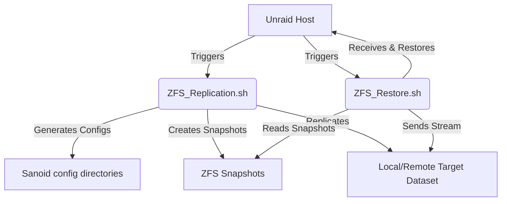

# ARCH_technical-specs — Core architecture and system boundaries

> **Compact, not incomplete.** Remove sections with no content. Never remove rules, edge cases, or reference rows to save space.

---

## Rules
> Hard constraints. AI must follow these unconditionally.

| Rule | Detail |
|------|--------|
| Target Version Compatibility | Designed for Unraid version 6.12 and above. |
| Path Structure | Backups are stored flat using underscores in place of dataset slashes. |

---

## Reference
> Lookup tables. No prose.

### Data Flow / System Components

| Component | Responsibility | Boundary |
|-----------|----------------|----------|
| `ZFS_Replication.sh` | Main orchestration script. Performs backups, prunes snapshots, generates config files, and notifies Unraid GUI. | Reads state from disk, executes Sanoid/Syncoid commands. |
| `ZFS_Restore.sh` | Restores datasets from local or remote snapshots interactively. | Prompts user on CLI, performs zfs send/receive pipeline. |
| Sanoid Config | Temp directories: `/mnt/user/system/sanoid/[dataset_underscored]/` | Contains custom `sanoid.conf` and symlink to default settings. |

---

## Edge Cases
> Only document cases that are non-obvious or have caused bugs.

- **Stale config cleanup**: Leftover custom Sanoid directories are automatically deleted using the `sanoid_state.txt` history file when datasets are removed from config.

---

*v0.0.1 — 2026-06-08*
